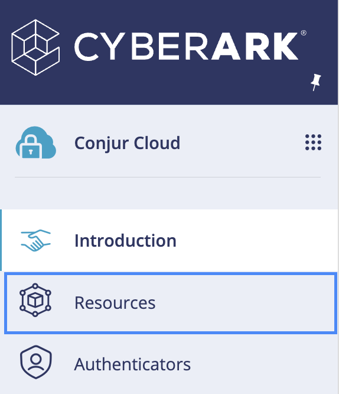

# JWT Policy Automation
JWT Policy Automation is a demonstration service that automates onboarding of a Safe into Privilege Cloud, onboarding a credential into that safe and onboarding a Kubernetes JWT annotated host with access through Conjur Cloud.

## Certification level


This repo is a **Community** level project. It's a community contributed project that **is not reviewed or supported
by CyberArk**. For more detailed information on our certification levels, see [our community guidelines](https://github.com/cyberark/community/blob/master/Conjur/conventions/certification-levels.md#community).


## Requirements

The below sections describe establishing and setting up resource dependencies in CyberArk Privilege Cloud ISPSS and Kubernetes.

### ISPSS

Administrative access to Identity Administration, Privilege Cloud and Conjur Cloud.

### Kubernetes

It is expected that prior to running the onboarding service, the preparation of the Kubernetes cluster and namespace has been performed in accordance with the documentation. See below link for reference:

[**K8s JWT: Setting up Workloads**](https://docs-er.cyberark.com/ConjurCloud/en/Content/Integrations/k8s-ocp/k8s-jwt-set-up-apps.htm)

### Certificates

A certificate must be issued from a internal Certificate Authority (CA), as well as the signing key for the certifiicate.

**Important**: Please make the necessary requests for PKI before setting up

The purpose of the certificate is for TLS signing of web server traffic from the intake form of the service


Generate CSR with the following attributes:

| Attribute   | Value                   | Description
| ----------- | ----------------------- | --------------------
| **Subject** | `{{ automation-service-name }}` | DNS entry for onboarding service in Kubernetes |
| **SAN**     | `{{ automation-service-name }}` | DNS entry for onboarding service in Kubernetes |
| X509 Extended Key Usage | `TLS Web Server Authentication (serverAuth)` | Extended Key usage for Web Server Authentication |

For `automation-service-name`, choose a name that you'd like to call the onboarding service (i.e., `onboarding`)

> **Note**: The key will need to be unencrypted prior to importing to PCloud in CyberArk ISPSS

## Service Deployment

Please Refer to [Setup](/SETUP.md) for guided deployment of the service.

## Usage Instructions

To test running the onboarding service, you'll first need to create an application identity. 

Navigating to the [onboarding service user form](https://onboarding.cybr.andyharrislab.com/ticket), use the following tables for reference:

**Safe Information**

| Attribute             | Value                         | Description           |
| --------------------- | ----------------------------- | --------------------- |
| Application Identity  | postgre                       | The CMBD CI Name or Label (Configuration Identifier) |
| Ownership Group       | user@cyberark.cloud.4272      | The group that should have access to the safe     |

**Credential Information**

| Attribute             | Value                      | Description               |
| --------------------- | -------------------------- | ------------------------- |
| Platform              | PROD_psql                  | Platform used in Onboard  |
| Username              | psql-adm                   | Demo psql service account |
| Password              | CyberArk1234##             | Demo password             |
| Address               | https://some-test.com      | `https://some-test.com` is a dummy service address for demo purposes |
| Query                 | postgre                    | The developer query for discovery in Conjur |
| Port                  | 5432                       | `5432` is the service port for PSQL; Can change depending on app-specific port dependencies |
| Database              | db-test                    | `some-test` web service Database name |

**Workload Identity**

| Attribute             | Value                      | Description          |
| --------------------- | -------------------------- | -------------------- |
| Namespace             | services              | `https://some-test.com` is a dummy service address for demo purposes |
| Service Account       | k8s-sa                | `k8s-sa` is the default service account created for the demo purposes |
| Cluster               | shared-eks            | `shared-eks` is the name of the eks cluster authenticator webservice configured and enabled in Conjur Cloud |


Once the form has been filled out like above, select the `SUBMIT` button at the bottom of the page.

---

If we're following the logs on the onboarding webservice, we'll see the following trace:

```
2023/04/18 20:16:57 Successfully built http client.
2023/04/18 20:17:00 {"safeUrlId":"AAM_POSTGRESQL-TEST","safeName":"AAM_POSTGRESQL-TEST","safeNumber":127,"description":"CHG1","location":"\\","creator":{"id":"6067e39a-35a1-4bb0-8e08-83feb1250acd","name":"aap4847_onboarding@cyberark.cloud.4272"},"olacEnabled":false,"managingCPM":"","numberOfVersionsRetention":null,"numberOfDaysRetention":0,"autoPurgeEnabled":false,"creationTime":1681849020,"lastModificationTime":1681849014144317}
2023/04/18 20:17:00 {"memberName":"zach@cyberark.cloud.4272","memberType":"User","permissions":{"manageSafe":true,"manageSafeMembers":true,"viewSafeMembers":true,"viewAuditLog":true,"useAccounts":true,"retrieveAccounts":true,"listAccounts":true,"addAccounts":true,"updateAccountContent":true,"updateAccountProperties":true,"renameAccounts":true,"deleteAccounts":true,"unlockAccounts":true}}
2023/04/18 20:17:03 Onboarded Synchronizer.
2023/04/18 20:17:03 Onboarded safe and updated group membership.
2023/04/18 20:17:03 Successfully onboarded credentials into AAM_POSTGRESQL-TEST
2023/04/18 20:17:03 Using authentication strategy api
2023/04/18 20:17:03 Successfully authenticated as host/data/apps/AAM_Automation_Operations to https://sme-andrew.secretsmgr.cyberark.cloud/api
2023/04/18 20:17:03 Sending request [https://sme-andrew.secretsmgr.cyberark.cloud/api/resources/conjur?kind=group&search=AAM_POSTGRESQL-TEST/delegation/consumers&limit=1]
2023/04/18 20:17:03 Safe not found, waiting for replication.. sleeping for 10 seconds..
2023/04/18 20:17:14 Sending request [https://sme-andrew.secretsmgr.cyberark.cloud/api/resources/conjur?kind=group&search=AAM_POSTGRESQL-TEST/delegation/consumers&limit=1]
2023/04/18 20:17:14 Safe not found, waiting for replication.. sleeping for 10 seconds..
2023/04/18 20:17:24 Sending request [https://sme-andrew.secretsmgr.cyberark.cloud/api/resources/conjur?kind=group&search=AAM_POSTGRESQL-TEST/delegation/consumers&limit=1]
2023/04/18 20:17:24 Safe not found, waiting for replication.. sleeping for 10 seconds..
2023/04/18 20:17:34 Sending request [https://sme-andrew.secretsmgr.cyberark.cloud/api/resources/conjur?kind=group&search=AAM_POSTGRESQL-TEST/delegation/consumers&limit=1]
2023/04/18 20:17:34 Safe not found, waiting for replication.. sleeping for 10 seconds..
2023/04/18 20:17:44 Sending request [https://sme-andrew.secretsmgr.cyberark.cloud/api/resources/conjur?kind=group&search=AAM_POSTGRESQL-TEST/delegation/consumers&limit=1]
2023/04/18 20:17:44 Safe not found, waiting for replication.. sleeping for 10 seconds..
2023/04/18 20:17:54 Sending request [https://sme-andrew.secretsmgr.cyberark.cloud/api/resources/conjur?kind=group&search=AAM_POSTGRESQL-TEST/delegation/consumers&limit=1]
...
```

Once the safe is either found or created, we'll get the following response from our onboarding webservice:

```
...
2023/04/18 20:17:54 Found Conjur Safe
2023/04/18 20:17:54 Successfully onboarded host to Conjur [201]
2023/04/18 20:17:54 Successfully entitled host to AAM_POSTGRESQL-TEST [201]
2023/04/18 20:17:54 {"created_roles":{},"version":1}
```

---

Now, if we return to the ``/ticket`` endpoint, and in the event the safe and account have been created and onboarded successfully, we should observe the page automatically redirect to ``/onboard`` and provide the following output (i.e., ``processing request ID`` and onboarding actions taken) using input values from the example provided above:

```
Processing Request ID: CHG1
Validated attributes...
Onboarding safe AAM_POSTGRESQL-TEST
Onboarded safe AAM_POSTGRESQL-TEST
Adding credentials to AAM_POSTGRESQL-TEST
Onboarded credentials into AAM_POSTGRESQL-TEST
Checking Conjur safe replication...
Found Conjur Safe
Attempting to create identity
Successfully created identity
Successfully entitled identity
```

Conversely, if we take a look at the Privileged Cloud platform, we can see the safe was created with the following members:


---

By now you might ask, "How does this look from Conjur?"

If we change platforms to Conjur Cloud in the top left-hand corner of the page...


We can switch views to our **Conjur Cloud** instance.

From there, we can click on **Resources**.



And from the **Resources** view, we can filter our view on resource type of *_Workloads_*.


From here, we can find our service account and its access of resources via its entitlements:


## Contributing

We welcome contributions of all kinds to this repository. For instructions on how to get started and descriptions
of our development workflows, please see our [contributing guide](CONTRIBUTING.md).

## License

Copyright (c) 2020 CyberArk Software Ltd. All rights reserved.

Licensed under the Apache License, Version 2.0 (the "License");
you may not use this file except in compliance with the License.
You may obtain a copy of the License at

   http://www.apache.org/licenses/LICENSE-2.0

Unless required by applicable law or agreed to in writing, software
distributed under the License is distributed on an "AS IS" BASIS,
WITHOUT WARRANTIES OR CONDITIONS OF ANY KIND, either express or implied.
See the License for the specific language governing permissions and
limitations under the License.

For the full license text see [`LICENSE`](LICENSE).
