# Deploying the Onboarding Service in Kubernetes

## Current Limitations 

* This has only been tested with CyberArk Privilege Cloud ISPSS

## Deployment Overview

The deployment is broken down into three phases:

- [Requirements](https://github.com/conjurdemos/JWT-Policy-Automation/blob/main/SETUP.md#requirements) 
  - [Kubernetes](https://github.com/conjurdemos/JWT-Policy-Automation/blob/main/SETUP.md#prerequisites-kubernetes)
  - [Certificates](https://github.com/conjurdemos/JWT-Policy-Automation/blob/main/SETUP.md#prerequisites-certificates)
  - [ISPSS](https://github.com/conjurdemos/JWT-Policy-Automation/blob/main/SETUP.md#prerequisites-ispss)
    - [a. Privilege Cloud](https://github.com/conjurdemos/JWT-Policy-Automation/blob/main/SETUP.md#a-privilege-cloud)
    - [b. Identity Administration](https://github.com/conjurdemos/JWT-Policy-Automation/blob/main/SETUP.md#b-identity-administration)
    - [c. Privilege Cloud](https://github.com/conjurdemos/JWT-Policy-Automation/blob/main/SETUP.md#c-privilege-cloud)
  - [Conjur Cloud](https://github.com/conjurdemos/JWT-Policy-Automation/blob/main/SETUP.md#prerequisites-conjur)
- [Setup](https://github.com/conjurdemos/JWT-Policy-Automation/blob/main/SETUP.md#setup)
  - [Kubernetes](https://github.com/conjurdemos/JWT-Policy-Automation/blob/main/SETUP.md#kubernetes)
- [Usage Demo](https://github.com/conjurdemos/JWT-Policy-Automation/tree/main#impact-2023-demo)

## Requirements

The below sections describe establishing and setting up resource dependencies in CyberArk Privilege Cloud ISPSS and Kubernetes.

### Prerequisites: Kubernetes

It is expected that prior to running the onboarding service, the preparation of the Kubernetes cluster and namespace has been performed in accordance with the documentation. See below link for reference:

[**K8s JWT: Setting up Workloads**](https://docs-er.cyberark.com/ConjurCloud/en/Content/Integrations/k8s-ocp/k8s-jwt-set-up-apps.htm)

### Prerequisites: Certificates

A certificate must be issued from a internal Certificate Authority (CA), as well as the signing key for the certifiicate.

**Important**: Please make the necessary requests for PKI before setting up

The purpose of the certificate is for TLS signing of web server traffic from the intake form of the service


Generate CSR with the following attributes:

| Attribute   | Value                   | Description
| ----------- | ----------------------- | --------------------
| **Subject** | `{{ automation-service-name }}` | DNS entry for onboarding service in Kubernetes |
| **SAN**     | `{{ automation-service-name }}` | DNS entry for onboarding service in Kubernetes |
| X509 Extended Key Usage | `TLS Web Server Authentication (serverAuth)` | Extended Key usage for Web Server Authentication |

For `automation-service-name`, choose a name that you'd like to call the onboarding service (i.e., `onboarding`)

> **Note**: The key will need to be unencrypted prior to importing to PCloud in CyberArk ISPSS

### Prerequisites: ISPSS

- Adhering to organizational safe naming guidelines, create a safe in PCloud that will be used for storing arifacts for configuring and running the onboarding service.

To do this...

#### a. Privilege Cloud

1. Log in to PCloud

2. Click on the dropdown next to **Policies** > **Safes**

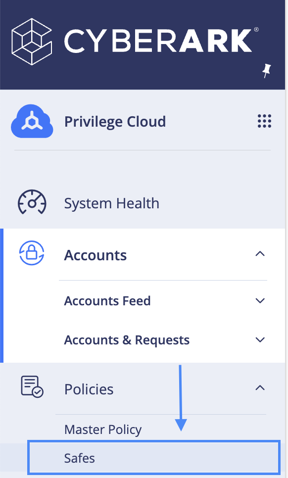

3. Click **Create Safe** in the top-right corner of the page

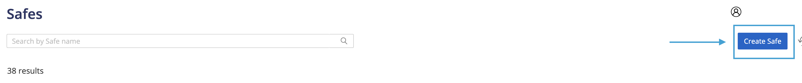

4. Create safe with your naming conventions (in our example, `AAM` is a part of the safe identifier naming convention - update this according to corporate standard) > Click **Next**

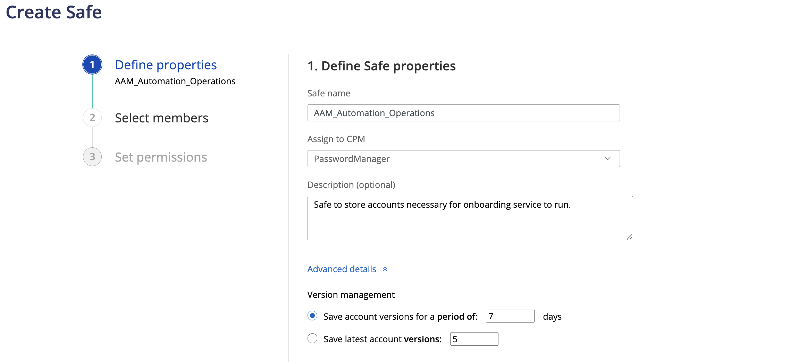

5. Under **Select Safe members**, select source as `System Component Users`, member type as `User` and in the **Search field**, type `sync` > Click **Search** > Select Conjur Sync by clicking the tick-box next to its name > **Next**

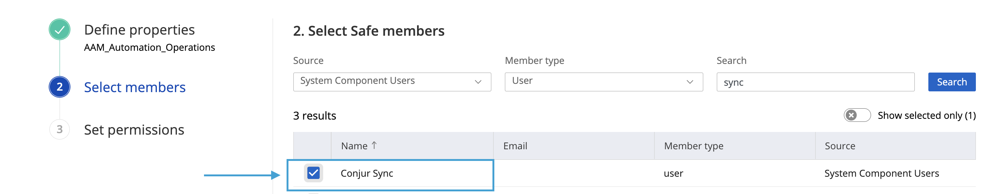

6. **Permissions** should look like the following reference tables:

**Access**

| Attributes         |
| ------------------ |
| List accounts      |
| Use accounts       |
| Retrieve accounts  |

**Workflow**

| Attributes                        |
| --------------------------------- |
| Access safe without confirmation  |

---

#### b. Identity Administration

- Under **Users**, create an Automation User that will interact with PCloud

  1. Under **Core Services**, select **Users**

  2. Under Users, click **Add User**

  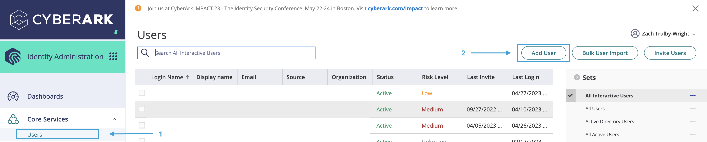

  3. Use the below table for reference for configuring the CyberArk Cloud Directory User:
  
  **Account**

  | Field Name           | Value                   | Description        |
  | -------------------- | ----------------------- | ------------------ |
  | Login name           | `aap****_onboarding`    | Login name for CyberArk Cloud Directory User               |
  | Display name         | `AAP**** Onboarding`    | Human-readable display name                                |
  | Password Type        | `Generated`             | Generates security-compliant password, according to policy |

**Important**: It is recommended to use the following syntax:

```
aap****_onboarding
```


> **Note**: `aap****` from the above example can be found by navigating to CyberArk Privilege Cloud ISPSS tenant portal (see image below):
>
> 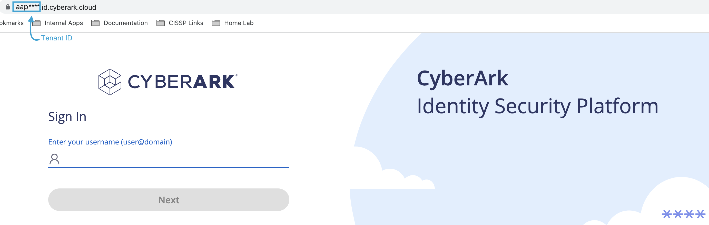

  **Status**

  | Attribute Name          | Box checked?     |
  | ----------------------- | ---------------- |
  | Locked                  | No               |
  | Password never expires  | Yes              |
  | Require pasword change at next login | No  |
  | Is service user         | Yes              |
  | Is OAuth confidential client | Yes         | 
  | Send email invite for user portal setup | No |
  | Send SMS invite for device enrollment | No   | 
  
  4. Once the user has been configured as above, click **Create User**

- Now, that the user `aap***_onboarding` has been successfully created, next add the Identity Directory Services User to "Privilege Cloud Administrators":

  1. Under **Core Services**, select **Roles**

  2. Under **Roles**, select ***Privilege Cloud Administrators*** role

  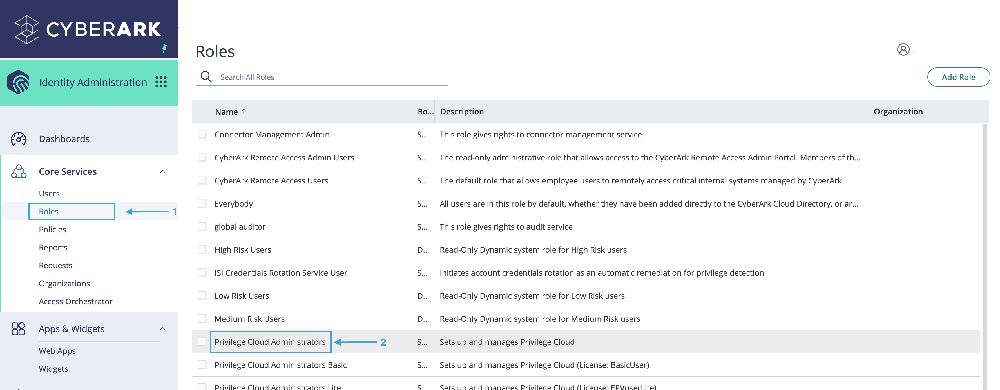

  3. Under **Privilege Cloud Administrators**, in the left-hand contextual menu, select **Members**

  4. Under **Members**, select **Add**

  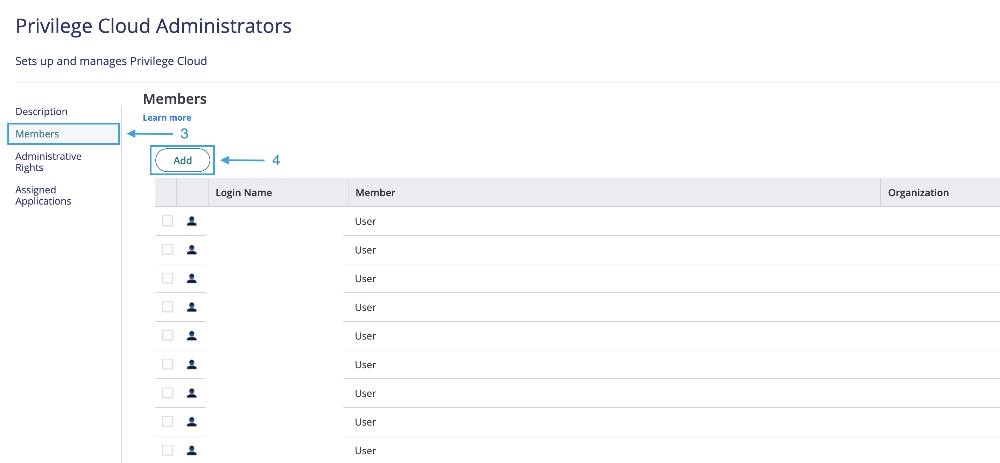

  5.  In the search field, enter the name of the user created previously (i.e., `aap****_onboarding`)

  6. Select that user from the populated result

  7. Select **Add**

  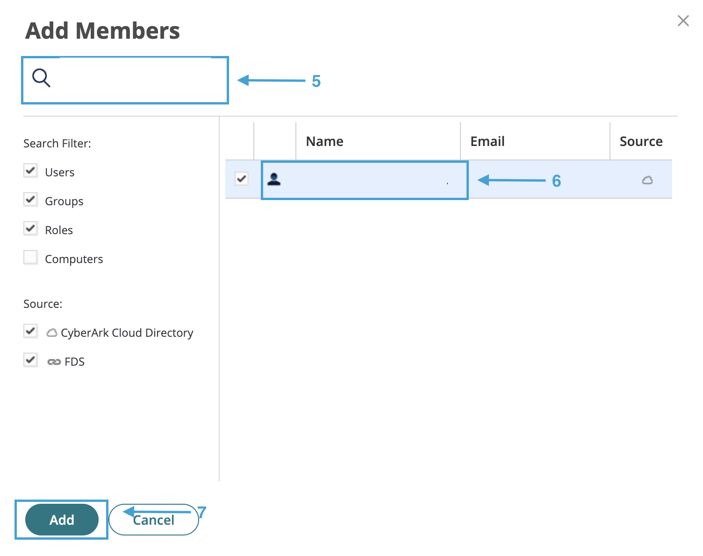


---

#### c. Privilege Cloud

Next, onboard Account for CyberArk Cloud Directory User:

To add the user to PCloud:

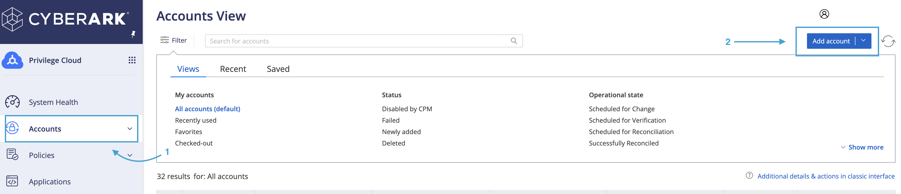

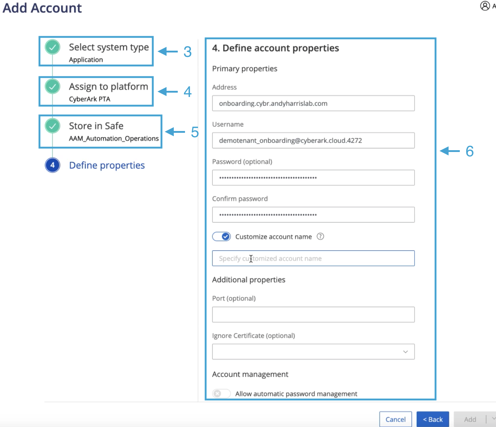

1. From Privilege Cloud, click **Accounts** from the left-hand context menu

2. In the top right-corner of the window, select **Add account**

3. Under **Select system type**, choose **Application** > Next

4. Under **Select platfrom**, choose **CyberArk PTA**

5. Under **Select Safe**, choose safename (i.e. `AAM_Deployment_Operations` following our example from above) `*`

6. Under **Define account properties** , fill out the following using the below reference table:

**Primary properties**

| Field Name        | Value                          | Description           |
| ----------------- | ------------------------------ | --------------------- |
| Address           | `{{ onboarding-service-dns }}` | The address of the DNS entry that resolves the service in K8s |
| Username          | `aap****_onboarding@{{ tenant-id }}` | CyberArk Cloud Directory User |
| Customize account name |  `onboarding-sa` `**`             | Friendly name for CyberArk Cloud Directory User |

**Additional properties**

| Field Name                    | Value                          | Description           |
| ----------------------------- | ------------------------------ | --------------------- |
| Port (optional)               | N/A                            | Default value         |
| Ignore Certificate (optional) | N/A                            | Default value         |

**Account management**

| Field Name        | Value                          | Description           |
| ----------------- | ------------------------------ | --------------------- |
| Allow automatic password management | Disabled     | Default value         |

> `*` Change this to safe name from [subsection](https://github.com/conjurdemos/JWT-Policy-Automation/blob/main/SETUP.md#a-privilege-cloud) above

> `**` Make sure toggle is set to *Enabled* next to **Customize account name**

---

> **Note**: To get **Username**:
> 1. In CyberArk Identity Administration, under **Users**, 
> 2. Under **Sets**, choose **All Users** 
> 3. Choose the user that was set up in [above subsection](https://github.com/conjurdemos/JWT-Policy-Automation/blob/main/SETUP.md#a-privilege-cloud)
>
> 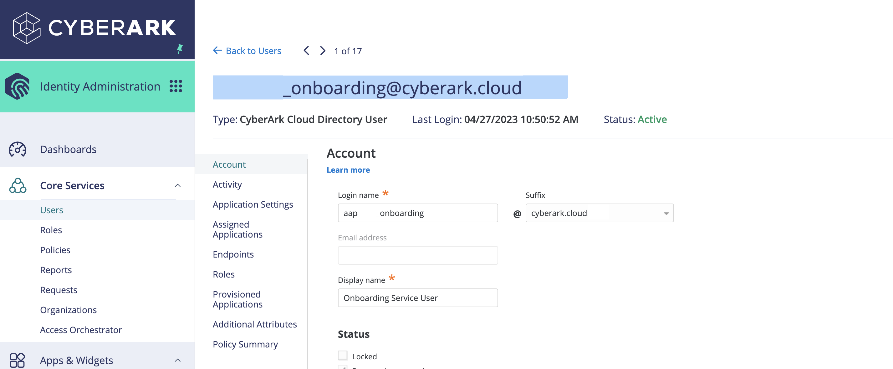

---

Add accounts in Privilege Cloud for CA-issued Key & Certificate

For Cert:


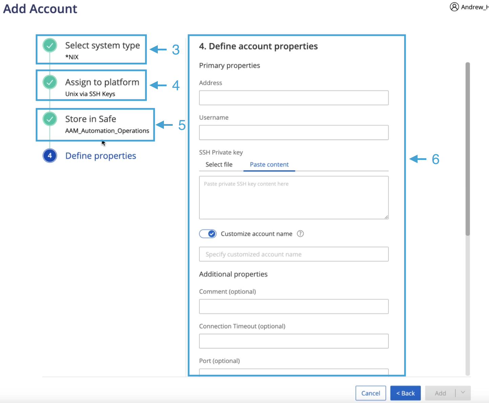

1. From Privilege Cloud, click **Accounts** from the left-hand context menu

2. In the top right-corner of the window, select **Add account**

3. Under **Select system type**, choose ***NIX** > Next

4. Under **Select platfrom**, choose **Unix via SSH Keys**

5. Under **Select Safe**, choose safename (i.e. `AAM_Deployment_Operations` following the example from above) `*`

6. Under **Define account properties** , fill out the following using the below reference table:

**Primary properties**

| Field Name        | Value                          | Description           |
| ----------------- | ------------------------------ | --------------------- |
| Address           | `{{ onboarding-service-dns }}` | The address of the DNS entry that resolves the service in K8s |
| Username          | `aap****_onboarding@{{ tenant-id }}` | CyberArk Cloud Directory User  |
| Customize account name |  `onboarding-cert` `**`     | Friendly name of CA-signed cert in Kubernetes |
| SSH Private key        | {{ cert-contents }} `***`    | The contents of the certificate file for the onboarding service |

**Note**: Leave all the other values as their default

> `*` Change this according to what safe name in above [subsection](https://github.com/conjurdemos/JWT-Policy-Automation/blob/main/SETUP.md#a-privilege-cloud)

> `**` This value will be used for configuration value for environment variable `CONJUR_OPCQUERY` in Kubernetes

> `***` Be sure to use **Paste content** toggle for ease of use

---

For Key:


1. From Privilege Cloud, click **Accounts** from the left-hand context menu

2. In the top right-corner of the window, select **Add account**

3. Under **Select system type**, choose ***NIX** > Next

4. Under **Select platform**, choose **Unix via SSH Keys**

5. Under **Select Safe**, choose safename (i.e. `AAM_Deployment_Operations` following)

6. Under **Define account properties** , fill out the following using the below reference table:

**Primary properties**

| Field Name        | Value                          | Description           |
| ----------------- | ------------------------------ | --------------------- |
| Address           | `{{ onboarding-service-dns }}` | The address of the DNS entry that resolves the service in K8s |
| Username          | `aap****_onboarding@{{ tenant-id }}` `*` | CyberArk Cloud Directory User |
| Customize account name |  `onboarding-key` `**` | Friendly name of the signing key of the onboarding service |
| SSH Private key        | `{{ cert-contents }}` `***`    | The contents of the key file for the onboarding service |

**Note**: Leave all the other values as their default

> `*` Change this according to what safe name in above [subsection](https://github.com/conjurdemos/JWT-Policy-Automation/blob/main/SETUP.md#a-privilege-cloud)

> `**` This value will be used for the configuration value in environment variable `CONJUR_OPKQUERY` in Kubernetes

> `***` Be sure to use **Paste content** toggle for ease of use

### Prerequisites: Conjur

**Note**: Perform the following actions prior to standing up the onboarding service in Kubernetes:

Download the following policy files from the project directory in [Github](https://github.com/conjurdemos/JWT-Policy-Automation):

* [10-proxy-auth-to-auto-host.yml](https://github.com/conjurdemos/JWT-Policy-Automation/blob/main/policy/10-proxy-auth-to-auto-host.yml)
* [20-automation-host-safe-load.yml](https://github.com/conjurdemos/JWT-Policy-Automation/blob/main/policy/10-proxy-auth-to-auto-host.yml)

Using the Conjur Cloud CLI:

> **Note**: Please see [Installing the CLI](https://docs-staging.conjur.org/ConjurCloud/en/Content/ConjurCloud/CLI/cli-setup.htm?tocpath=Administration%7CConjur%20Cloud%20CLI%7C_____1) if not installed previously

- Load the following policies:

  - First policy load:

```
conjur policy load -b data -f 10-proxy-auth.yml
```

This does a few things –
  1. Creates a service account host identity in Conjur
  2. Shares authentication entitlements to the authenticators under parent branch `data/apps`
  3. Grants resource entitlements to safes accessible by `data/apps-admins` and `data/vault-admins`

  - Second policy load:

```
conjur policy load -b data/vault/{{ Automation_Operations }}/delegation -f 20-automation-host-safe-load.yml
```

**Note**: Where `{{ Automation_Operations }}` is the name of the safe added to PCloud earlier in this section

- This will add the onboarding service account created in `10-proxy-auth.yml` to the consumers group for its corresponding safe branch in Conjur

## Setup

### Kubernetes

Prep the namespace for the onboarding service to run.

```
kubectl apply -f prep.yml
```

This will create the namespace and the service account.

Populate the environment variables in `manifests/deployment.yml`.

Under `env`, update the manifest with the following values:

| Config Key         | Value                          | Description                                             | 
| ------------------ | ------------------------------ | ------------------------------------------------------- |
| CONJUR_TOKEN_PATH  | `"/run/conjur/access-token"`      | Default value which shouldn't change                    |
| AUTHN_STRATEGY     | `"k8s"`                           | Currently only supported authentication type for this service |
| SERVICE_PORT       | `"8443"`                          | This is the service port the webservices run under in K8s`*` |
| CONJUR_URL         | `"https://{{ secrets-manager-uri }}/api"`  | Conjur Cloud URL |
| CONJUR_SAFE        | `"{{ Automation_Operations }}"`     | Name of safe created to support onboarding service |
| CONJUR_PASQUERY    | `"onboarding-sa"`                 | Custom account name of CyberArk Cloud Directory User in PCloud safe |
| CONJUR_OPCQUERY    | `"onboarding-cert"`               | CA-Issued Certificate |
| CONJUR_OPKQUERY    | `"onboarding-key"`                | CA-Issued Key |
| SAFE_PREFIX        | `"AAM_"` `**`                          | In our example, `AAM` is part of naming convention  |
| PAS_URI            | `"https://{{ pcloud-uri }}"`    | ISPSS (PCloud Tenant ID) |
| TENANT             | `"aap****"`                     | Tenant ID of user `aap****_onboarding` |
| CONJUR_HOST_BRANCH | `"data/apps"`                   | Parent branch for host creation in Conjur |

> `*`: AAM is an three-letter acronym for the class of application (Application Access Management)

> `**`: This value **must match** the value of variable `containers:containerPort` in `manifest/deployment.yml`, such as below:

***deployment.yml***

```
...
19      containers:
20        - name: app
21          image: 
22          ports:
23            # Used for HTTPS Services
24            - containerPort: 8443
25              name: on-svc-port
...
```

**Additional Note**: Ensure that all instances of `onboarding` in both `prep.yml` and `deployment.yml` match *exactly* (i.e., Lines 5 and 9 in `service.yml` matches Lines 6, 7, 11, and 16 in `deployment.yml`)

***service.yml***
```
...
 4 metadata:
 5   name: onboarding
 6 spec:
 7   type: LoadBalancer
 8   selector:
 9     app: onboarding
...
```

***deployment.yml***
```
...
 2 apiVersion: apps/v1
 3 kind: Deployment
 4 metadata:
 5   labels:
 6     app: onboarding
 7   name: onboarding
...
10     matchLabels:
11       app: onboarding
...
14     metadata:
15       labels:
16         app: onboarding
...
```

Once all validation has been completed and `deployment.yml` is properly configured, apply the modified manifest:

```
kubectl apply -f deployment.yml
```

Apply the final manifest which stands up the service:

```
kubectl apply -f service.yml -n cyberark-conjur
``` 

This command gets the  DNS entry for the service...

```
kubectl get svc -n conjur-automation
```

This next command will expose the `EXTERNAL_IP` address, which is what is needed to register in DNS:

```
kubectl get po -n conjur-automation
```

Here's a helper command to get logs from the service:

```
kubectl logs {{ pod-name }} -n conjur-automation
```

Create an entry for that service in DNS that resolves to the IP address associated above.

## Troubleshooting

**Conjur**

- `422 Unprocessible ENT`: Double-check the policy for non-printable control characters. Sometimes, pasting from DOS to UNIX can incorporate these. Make sure to remove them before loading the policy file, and double-check for visual discrepencies. For further assistance, [follow this link](https://docs.cyberark.com/Product-Doc/OnlineHelp/AAM-DAP/12.9/en/Content/Developer/Conjur_API_Replace_Policy.htm#Response) for this and other well-known responses and their meaning.
